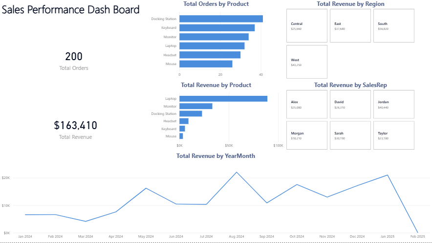

# Sales Performance Dashboard 

## Overview
This project analyzes sales performance across products, regions, and sales representatives using Power BI.

## Key Metrics
Total Orders: 200
Total Revenue: $163,410

## Business Questions Answered
• Which products generate the most revenue?

• Which regions perform best?

• Which sales reps drive the most sales?

• How does revenue trend over time?

## Dashboard Preview

